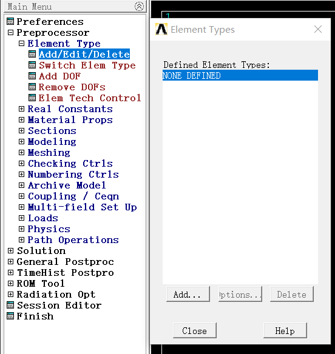

# 《有限元法及其应用》作业


## 准备工作与环境创建

1）运行Mechanical APDL Product Launcher 18.2。

2）选中【File Management】，在“Working Directory”栏输入工作目录“C:\Users\meirtz\Desktop\ANSYS Projects\Tunnel-Simulationl”，在“Job Name”栏输入文件名“Tunnel”。

3）单击“RUN”按钮，进入ANSYS18.1 的GUI 操作界面。

4）过滤图形界面：Main Menu> Preferences，弹出“Preferences for GUI Filtering”对话框，
选中“Structural”来对后面的分析进行菜单及相应的图形界面过滤。


5）定义单元类型：Main Menu> Preprocessor> Element Type> Add/Edit/Delete，弹出“Element
Types”单元类型对话框，单击“Add”按钮，弹出“Library of Element Types”
单元类型库对话框，如图3-6 所示。在该对话框左面滚动栏中选择“Beam”，在右边的滚动栏
中选择“2D-elastic 3”，单击“Apply”，定义了“Beam188”单元。再在左面滚动栏中选取
“Combination”，右边的滚动栏中选择“Spring-damper 14”。然后单击“OK”
按钮，这就定义了“Combin14”单元，最后单击单元类型对话框中的“Close”按钮。

<center></center>


6）定义材料属性：Main Menu> Preprocessor> Material Props> Material Models，弹出“Define
Material Model Behavior”对话框。在右边的栏中连续双击“Structural> Linear>
Elastic>Isotropic”后，又弹出“Linear Isotropic Properties for Material Number 1”对
话框，在该对话框中“EX”后面的输入栏输入“3E10”，在“PRXY” 后面的输入栏输入“0.2”，
单击“OK”。再在定义材料本构模型对话框 选中“Density”并双击，弹出“Density
for Material Number 1”对话框，在“DENS”后面的栏中输入隧道衬砌混凝土材料的密度“0.2”，
再单击“OK”按钮。


## 创建模型以及网格划分

1）创建隧道衬砌支护关键点：Main Menu> Preprocessor> Modeling> Create>Keypoints>In Active CS，弹出“Creae Keypoints in Active Cooedinate System”对话框，在“NPT keypoint number”栏后面输入“1”，在“X，Y，Z Location in active CS”栏后面输入“（0，0，0）”，单击“Apply”按钮，这样就创建了关键点1。但是由于关键点较多，重复创建比较繁琐，也可以直接使用命令流的方式创建，随后“2、3、4、5、6、7”点的坐标分别为：0，3.85，0）、（0.88，5.5，0）、（2.45，6.15，0）、（4.02，5.5，0）、（4.9，3.85，0）、（4.9，0，0）。


2）创建隧道衬砌支护线模型：Main Menu>Preprocessor>Modeling>Create>Lines>Arcs>By End KPs & Rad，弹出如图3-20所示的对话框。在对话框栏中输入关键点“1，2”，单击“Apply”，在对话框栏中输入关键点“6”，弹出“Arc By End KPs & Rad ”对话框。在“RAD Radius of the arc”栏后面输入弧线半径“8.13”，单击“Apply”。

<center></center>

重复以上操作步骤，分别把图中对话框栏中空栏依次输入“3.21，2，3，6”、“2.22，3，4，6”、“2.22，4，5，2”、“3.21，5，6，2”、 “8.13，6，7，2”、“6，7，1，4”，最后单击“OK”按钮，生成隧道衬砌支护线模型。

3）保存几何模型文件；Utility Menu> File> Save as，弹出一个“Save Database”对话框，在“Save Database to”下面输入栏中输入文件名“Support-geom.db”，单击“OK”。

4）给线赋予特性：Main Menu> Preprocessor> Meshing> MeshTool，弹出“MeshTool”对话框。在“Element Attributes”后面的下拉式选择栏中选择“Lines”，按“Set”按钮，弹出一个“Lines Attributes”线拾取框，在图形界面上拾取编号为“L1、L2、L3、L4、L5、L6”的线，单击拾取框上的“OK”按钮，又弹出一个如图3-25所示的“Lines Attributes”对话框，在“Material number”后面的下拉式选择栏中选取“1”，在“Section” 后面的下拉式选择栏中选取“1”，在“Element type number ” 后面的下拉式选择栏中选取“1 BEAM188”。单击“Apply”再次弹出线拾取框。
用相同方法给线L7赋予特性，其他选项与“L1、L2、L3、L4、L5、L6”的线一样，只是在“Section” 后面的下拉式选择栏中选取“2”，单击“OK”按钮退出。

<center></center>

5）控制线尺寸：在“MeshTool”对话框中的“Size controls”下面的选择栏中的“Lines”右边单击“Set”，在弹出对话框中拾取线L1和L6，单击拾取框上的“OK”按钮，弹出“Element Sizes on All Selected Lines”对话框，如图所示。在“No of element divisions ”栏后面输入“4”。再单击“Apply”按钮。

<center></center>

用相同方法控制线L2、L3、L4、L5、L7的尺寸，只是线L2、L3、L4、L5在“No of element divisions ”栏后面输入“2”，线L7在“No of element divisions ”栏后面输入“8”。

6）划分网格：在图3-24 网格划分工具栏中单击“Mesh”按钮，弹出一个对话框，单击“Pick ALL”，生成24个梁单元。然后进入Utility Menu> PlotCtrls> Numbering，弹出“Plot Numbering Controls”对话框，如图3-28所示。选中“Node Numbers” 选项，后面的文字由“off”变为“on”,单击“OK”关闭窗口。

<center></center>

7）创建弹簧单元：由于新版的ANSYS中GUI界面不能创建弹簧单元，所以此处我们选择命令流，创建弹簧单元的命令流为` PSPRNG ` ，其格式为`  PSPRNG, NLOC , TYPE , K , DX , DY , DZ , ELEM` 。我们知道，节点1对应“DX，DY”为-0.97029572，-0.241921895”，节点2对应“DX，DY”为“-0.97437006，0.22495105”，节点3对应“DX，DY”为“-0.98628560，-0.1604768”，节点4对应“DX，DY”为“-0.99996192，- 0.00872654”，节点5对应“DX，DY”为“-0.98901586，0.14780941”，节点6对应“DX，DY”为“-0.70710678，0.70710678”，节点7对应“DX，DY”为“-0.88294757，0.469471561”，节点10对应“DX，DY”为“0.70710678，0.70710678”，节点13对应“0.88294757，0.469471561”，节点12对应“DX，DY”为“0.97437006，0.22495105”，节点15对应“DX，DY”为“0.98901586，0.14780941”，节点16对应“DX，DY”为“0.99996192，- 0.00872654”，节点17对应“DX，DY”为“0.98628560，-0.1604768”，节点14对应“DX，DY”为“0.97029572，-0.241921895”，节点18对应“DX，DY”为“0.30901699，-0.95105651”，节点24对应“DX，DY”为“-0.30901699，-0.95105651”，节点19对应“DX，DY”为“0.20791169，-0.97814760”，节点23对应“DX，DY”为“-0.20791169，-0.97814760”，节点20对应“DX，DY”为“0.10452846，-0.99452189”，节点22对应“DX，DY”为“-0.10452846，-0.99452189”，节点21对应“DX，DY”为“0，-1”，所有点的DZ都为0，K均为300000000。依次输入以下命令流来创建弹簧单元：

```fortran
PSPRNG,2,,300000000,-0.97437006,0.22495105,0

PSPRNG,3,,300000000,-0.98628560,-0.1604768,0

PSPRNG,4,,300000000,-0.99996192,-0.00872654,0

PSPRNG,5,,300000000,-0.98901586,0.14780941,0

PSPRNG,6,,300000000,-0.70710678,0.70710678,0

PSPRNG,7,,300000000,-0.88294757,0.469471561,0

PSPRNG,10,,300000000,0.70710678,0.70710678,0

PSPRNG,13,,300000000,0.88294757,0.469471561,0

PSPRNG,12,,300000000,0.97437006,0.22495105,0

PSPRNG,15,,300000000,0.98901586,0.14780941,0

PSPRNG,16,,300000000,0.99996192,-0.00872654,0

PSPRNG,17,,300000000,0.98628560,-0.1604768,0

PSPRNG,14,,300000000,0.97029572,-0.241921895,0

PSPRNG,18,,300000000,0.30901699,-0.95105651,0

PSPRNG,24,,300000000,-0.30901699,-0.95105651,0

PSPRNG,19,,300000000,0.20791169,-0.97814760,0

PSPRNG,23,,300000000,-0.20791169,-0.97814760,0

PSPRNG,20,,300000000,0.10452846,-0.99452189,0

PSPRNG,22,,300000000,-0.10452846,-0.99452189,0

PSPRNG,21,,300000000,0,-1,0
```

得到添加弹簧单元的单元网格图，如图所示。

<center></center>

## 施加约束和荷载

1）给弹簧单元施加约束：Main Menu>Solution>Define Loads>Apply>Structural>Displacement>on Nodes，弹出在节点上施加位移约束对话框，用鼠标选取弹簧单元最外层节点共21个节点，单击“OK”按钮，弹出“Apply U,ROT on Nodes”窗口，在“DOFS to be constrained”栏后面中选取“UX，UY， UZ”，在“Displacement value”栏后面输入“0”值，点击Apply；同样的操作选取隧道上所有节点，但是只选择“UZ”。

<center></center>


2）施加重力加速度：Main Menu>Solution>Define Loads>Apply>Structural>Inertia>Gravity，弹出“Apply(Gravitational)Acceleration”对话框，所示。只需在“Global Cartesian Y-comp”栏后面输入重力加速度值“9.8”就可以，单击“OK”按钮，就完成了重力加速度的施加。

<center></center>

3）对隧道衬砌支护施加围岩压力：Main Menu>Solution>Define Loads>Apply>Structural> Force/Moment >on Nodes，在弹出节点位置施加荷载对话框中，用鼠标选择隧道支护线上腰部和顶部所有节点，弹出“Apply F/M on Nodes”对话框，如图3-24所示。在“Direction of force/mom”栏后面下拉菜单中选取“FY”，在“Force/Moment”栏中输入围岩垂直匀布力“-80225”。

<center></center>

单击“Apply”按钮，在弹出对话框后选择隧道支护线剩下的节点，在“Direction of force/mom”栏后面下拉菜单中选取“FY”，在“Force/Moment”栏中输入围岩垂直匀布力“80225”。

再单击“Apply”按钮，又弹出一个节点位置施加荷载对话框，用鼠标选择隧道衬砌支护线上的1、2、3、4、5、6、7、8、9、22、23、24共12个节点，又弹出如图3-24所示的对话框，在“Direction of force/mom”栏后面下拉菜单中选取“FX”，在“Force/Moment”栏中输入围岩水平匀布力“16045”。
再次单击“Apply”按钮，又弹出一个节点位置施加荷载对话框，用鼠标选择隧道衬砌支护线上剩下的12个节点，又弹出如图3-24所示的对话框，在“Direction of force/mom”栏后面下拉菜单中选取“FX”，在“Force/Moment”栏中输入围岩水平匀布力“-16045”。单击“OK“按钮，就完成了对隧道衬砌支护施加围岩压力。

4）对隧道仰拱施加水压：Main Menu>Solution>Define Loads>Apply>Structural> Force/Moment >on Nodes，在弹出节点位置施加荷载对话框中，用鼠标选择隧道仰拱节点18，弹出对话框，在“Direction of force/mom”栏后面下拉菜单中选取“FX”，在“Force/Moment”栏中输入水平水压力“-161803”。再次单击“Apply”按钮，又弹出一个对话框，选择节点18，又弹出对话框，在“Direction of force/mom”栏后面下拉菜单中选取“FY”，在“Force/Moment”栏中输入围岩水平匀布力“70381”，单击“OK”按钮，就完成了节点18的水压力的施加，同法对仰拱的其它节点施加水压，只是数值不同：节点19“FY=50101”、“FX=-182309”；节点20“FY=13093”、“FX=-198904”；节点21“FY=125960”、“FX=0；节点22“FY=13093”、“FX=198904”；节点23“FY=50101”、“FX=182309”；节点24“FY=70381”、“FX=161803”。最后得到施加约束和荷载后隧道衬砌支护结构模型图，如图所示。

<center></center>


## 求解与后处理


1）求解运算：Main Menu>Solution>Solve>Current LS，弹出一个求解选项信息和一个当前求解载荷步对话框，如图 3-36 和图 3-37 所示，检查信息无错误后，单击“OK”，开始求解运算，直到出现一个“Solution is done”的提示栏，表示求解结束。

2）定义工作标题：Utility Menu> File> Change Title，在弹出的对话框中输入“Tunnel Support Structural Analysis”，单击“OK”，

3）查看隧道衬砌支护结构变形图：Main Menu>General Postproc>Plot Results>Deformed shape，弹出一个“Plot Deformed Shape”的对话框，如图 3-39 所示，选中“Def+undeformed”并单击“OK”，出现隧道衬砌支护结构变形图

<center></center>


4）查看第 2 次分析计算结构变形图：Main Menu>General Postproc>Plot Results>Deformed shape，弹出一个“Plot Deformed Shape”的对话框，选中“Def+undeformed”并单击“OK”，出现第 2 次分析计算的隧道衬砌支护结构变形图。图形显示，第 2 次分析计算仍有受拉弹簧。
 5）再次去掉受拉弹簧，重复 3）~4），直到分析计算出的隧道衬砌支护结构变形图中没有受拉弹簧为止，终于得到没有受拉弹簧时的隧道结构模型，如图所示。Main Menu>General Postproc>Plot Results>Deformed shape，弹出一个“Plot Deformed Shape”的对话框，选中“Def+undeformed”并单击“OK”就得到隧道结构变
形图，如图 所示。

<center></center>


6）将节点弯矩、剪力、轴力制表：Main Menu>General Postproc>Element Table>Define Table，弹出一个“Element Table Data”对话框，如图 3-43 所示。单击“Add”按钮，弹出一个“Define Additional Element Table Items”对话框。在图 对话框中，在“User label for item”栏后面输入“IM”，在“Item Comp Results data item”栏后面的左边下拉菜单中选取“By sequence num”，在右栏输入“3”，然后单击“Apply”按钮；再次在“User label for item”栏后面输入“JMOMEMT”，在“Item Comp Results data item”栏后面的左边下拉菜单中选取“By sequence num”，在右栏输入“13”，然后单击“Apply”按钮；这样同样方法依次输入“IS，5”、“JS，18”、“Z-I，1”、“Z-J，14”，最后得到定义好后的单元数据表对话框，如图所示。

<center></center>

7）设置弯矩分布标题：Utility Menu> File> Change title，弹出一个“Change Title”对话框，如图 3-46 所示。在“Enter new title”下面的输入栏中输入文件名“BENDING MOMENT distribution”，单击“OK”。

<center></center>

8）画结构弯矩图：Main Menu>General Postproc>Plot Results>Contour Plot>Line Element Results，弹出一个“Plot Line-Element Results”对话框。在“Element table item at node I”栏后面下拉菜单选取“IM”，在“Element table item at node J”栏后面下拉菜 单选取“JM”，在“Optional scale factor”后面栏中输入“-0.8”，在“Items to be plotted on”栏后面选中“Deformed shape”，单击“OK”按钮。

<center></center>

得到隧道衬砌支护结构的弯矩图，如图所示。

<center></center>

9）由于之前定义的BEAM188是线性材料，现在可以将BEAM188的插值函数改为Cubic以使其更符合现实。Main Menu> Preprocessor> Element Type> Add/Edit/Delete，选择BEAM188，点击”Options“，弹出“Element Types”单元类型对话框，在“Element behavior K3”处选择“Cubic Form”。如图所示。

<center></center>

然后：Main Menu>Solution>Solve>Current LS，弹出一个求解选项信息和一个当前求解载荷步对话框，接受默认设置，单击“OK”，重新求解运算。重新Main Menu>General Postproc>Element Table>Define Table，弹出“Element Table Data”对话框，点击下方的Update更新表值。重新画结构弯矩图：Main Menu>General Postproc>Plot Results>Contour Plot>Line Element>Results，操作均与之前的相同。得到新的弯矩图如图所示。

<center></center>


10）画结构剪力图：Main Menu>General Postproc>Plot Results>Contour Plot>Line Element Results，弹出一个如图 3-49 所示的对话框。在“Element table item at node I”栏后面下拉菜单选取“I”，在“Element table item at node J”栏后面下拉菜单选取“JS”，在“Optional scale factor”后面栏中输入“-1”，在“Items to be plotted on”栏后面选中“Deformed shape”，单击“OK”按钮，得到隧道衬砌支护结构的剪力图，如图所示。

<center></center>

11）画结构轴力图：Main Menu>General Postproc>Plot Results>Contour Plot>Line Element Results，弹出一个对话框。在“Element table item at node I”栏后面下拉菜单选取“ZI”，在“Element table item at node J”栏后面下拉菜单选取“ZJ”，在“Optional scale factor”后面栏中输入“-0.6”，在“Items to be plotted on”栏后面选中“Deformed shape”，单击“OK”按钮，得到隧道衬砌支护结构的轴力图，如图所示。

<center></center>


## 列出主要数据

1）选择隧道支护线上所有节点：Utility Menu>Entities….，弹出一个“Select Entities”对话
框，如图 3-52 所示。在第一个下拉菜单选择“Nodes”，在第 2 个下拉菜单选择“By Num/Pick”，
第 3 栏选中“From Full”，单击“OK”按钮，弹出一个选择节点对话框，用鼠标选取隧道支护
线所有节点，单击“OK”按钮。

<center></center>

2）选择隧道支护线上所有单元：Utility Menu>Entities….，弹出一个“Select Entities”对话框，如图 3-53 所示。在第一个下拉菜单选择“Elements”，在第 2 个下拉菜单选择“By Num/Pick”，第 3 栏选中“Also Selected”，单击“OK”按钮，弹出一个选择单元对话框，用鼠标选取隧道支护线所有单元，单击“OK”按钮。

3）列表显示各节点的位移：Main Menu>General Postproc>List Results>Nodal Solution，弹出一个“List Nodal Solution”对话框。用鼠标依次单击“Nodal Solution”和“DOF SOLUTION”，再选中“Displacement Vector Sum”，然后单击“OK”按钮，弹出节点位移数据文件。再次执行 Main Menu>General Postproc>List Results>Nodal Solution，弹出一个“List Nodal Solution”对话框。用鼠标依次单击“Nodal Solution”和“DOF SOLUTION”，再选中“Rotation Vector Sum”，然后单击“OK”按钮，弹出节点位移数据文件。
最后得到各节点的位移数据，如表所示。

| NODE  | UX            | UY                      | UZ     | USUM         |
| ----- | ------------- | ----------------------- | ------ | ------------ |
| 1     | -0.14233E-003 | -0.63930E-003           | 0.0000 | 0.65495E-003 |
| 2     | -0.51416E-004 | -0.77184E-003           | 0.0000 | 0.77355E-003 |
| 3     | -0.21888E-003 | -0.68382E-003           | 0.0000 | 0.71800E-003 |
| 4     | -0.21563E-003 | -0.70957E-003           | 0.0000 | 0.74161E-003 |
| 5     | -0.15616E-003 | -0.73489E-003           | 0.0000 | 0.75130E-003 |
| 6     | 0.18631E-003  | -0.92555E-003           | 0.0000 | 0.94412E-003 |
| 7     | 0.74384E-004  | -0.83081E-003           | 0.0000 | 0.83414E-003 |
| 8     | 0.25270E-003  | -0.10909E-002           | 0.0000 | 0.11198E-002 |
| 9     | 0.24368E-003  | -0.10220E-002           | 0.0000 | 0.10506E-002 |
| 10    | 0.24719E-003  | -0.10925E-002           | 0.0000 | 0.11202E-002 |
| 11    | 0.24328E-003  | -0.11106E-002           | 0.0000 | 0.11369E-002 |
| 12    | 0.29020E-003  | -0.10401E-002           | 0.0000 | 0.10798E-002 |
| 13    | 0.27073E-003  | -0.10621E-002           | 0.0000 | 0.10960E-002 |
| 14    | -0.27460E-004 | -0.90652E-003           | 0.0000 | 0.90693E-003 |
| 15    | 0.28358E-003  | -0.10225E-002           | 0.0000 | 0.10611E-002 |
| 16    | 0.24156E-003  | -0.10024E-002           | 0.0000 | 0.10311E-002 |
| 17    | 0.14855E-003  | -0.97005E-003           | 0.0000 | 0.98136E-003 |
| 18    | -0.94599E-004 | -0.69847E-003           | 0.0000 | 0.70485E-003 |
| 19    | -0.12995E-003 | -0.51155E-003           | 0.0000 | 0.52780E-003 |
| 20    | -0.13309E-003 | -0.37662E-003           | 0.0000 | 0.39944E-003 |
| 21    | -0.11405E-003 | -0.30548E-003           | 0.0000 | 0.32607E-003 |
| 22    | -0.91514E-004 | -0.31021E-003           | 0.0000 | 0.32343E-003 |
| 23    | -0.83892E-004 | -0.37764E-003           | 0.0000 | 0.38684E-003 |
| 24    | -0.10112E-003 | -0.49791E-003           | 0.0000 | 0.50808E-003 |
| 25    | 0.0000        | 0.0000                  | 0.0000 | 0.0000       |
| 27    | 0.0000        | 0.0000                  | 0.0000 | 0.0000       |
| 28    | 0.0000        | 0.0000                  | 0.0000 | 0.0000       |
| 29    | 0.0000        | 0.0000                  | 0.0000 | 0.0000       |
| 35    | 0.0000        | 0.0000                  | 0.0000 | 0.0000       |
| 36    | 0.0000        | 0.0000                  | 0.0000 | 0.0000       |
| 37    | 0.0000        | 0.0000                  | 0.0000 | 0.0000       |
| 38    | 0.0000        | 0.0000                  | 0.0000 | 0.0000       |
| 39    | 0.0000        | 0.0000                  | 0.0000 | 0.0000       |
| 40    | 0.0000        | 0.0000                  | 0.0000 | 0.0000       |
| 41    | 0.0000        | 0.0000                  | 0.0000 | 0.0000       |
| 42    | 0.0000        | 0.0000                  | 0.0000 | 0.0000       |
| 43    | 0.0000        | 0.0000                  | 0.0000 | 0.0000       |
| 44    | 0.0000        | 0.0000                  | 0.0000 | 0.0000       |
| 45    | 0.0000        | 0.0000                  | 0.0000 | 0.0000       |
|       |               | MAXIMUM ABSOLUTE VALUES |        |              |
| NODE  | 12            | 11                      | 0      | 11           |
| VALUE | 0.29020E-003  | -0.11106E-002           | 0.0000 | 0.11369E-002 |


| NODE  | ROTX          | ROTY                    | ROTZ          | RSUM         |
| ----- | ------------- | ----------------------- | ------------- | ------------ |
| 1     | -0.12616E-005 | 0.90983E-006            | 0.15881E-003  | 0.15881E-003 |
| 2     | 0.90947E-006  | 0.33668E-005            | -0.12789E-003 | 0.12794E-003 |
| 3     | -0.15527E-006 | 0.19873E-005            | 0.45209E-004  | 0.45253E-004 |
| 4     | 0.45861E-008  | 0.26607E-005            | -0.30540E-004 | 0.30656E-004 |
| 5     | 0.37721E-006  | 0.31318E-005            | -0.86548E-004 | 0.86605E-004 |
| 6     | 0.26885E-005  | 0.24616E-005            | -0.13814E-003 | 0.13819E-003 |
| 7     | 0.16967E-005  | 0.32289E-005            | -0.14765E-003 | 0.14769E-003 |
| 8     | 0.35565E-005  | 0.21031E-017            | -0.52572E-004 | 0.52693E-004 |
| 9     | 0.33077E-005  | 0.13806E-005            | -0.10256E-003 | 0.10262E-003 |
| 10    | 0.26885E-005  | -0.24616E-005           | 0.25768E-004  | 0.26025E-004 |
| 11    | 0.33077E-005  | -0.13806E-005           | -0.48394E-005 | 0.60222E-005 |
| 12    | 0.90947E-006  | -0.33668E-005           | 0.10757E-004  | 0.11309E-004 |
| 13    | 0.16967E-005  | -0.32289E-005           | 0.30727E-004  | 0.30943E-004 |
| 14    | -0.12616E-005 | -0.90983E-006           | -0.26767E-003 | 0.26768E-003 |
| 15    | 0.37721E-006  | -0.31318E-005           | -0.23877E-004 | 0.24084E-004 |
| 16    | 0.45861E-008  | -0.26607E-005           | -0.72096E-004 | 0.72145E-004 |
| 17    | -0.15527E-006 | -0.19873E-005           | -0.14759E-003 | 0.14760E-003 |
| 18    | -0.14509E-005 | -0.53080E-006           | -0.29148E-003 | 0.29148E-003 |
| 19    | -0.15393E-005 | -0.33701E-006           | -0.24104E-003 | 0.24105E-003 |
| 20    | -0.15881E-005 | -0.16836E-006           | -0.15487E-003 | 0.15488E-003 |
| 21    | -0.16043E-005 | -0.17387E-015           | -0.53135E-004 | 0.53160E-004 |
| 22    | -0.15881E-005 | 0.16836E-006            | 0.47657E-004  | 0.47684E-004 |
| 23    | -0.15393E-005 | 0.33701E-006            | 0.13219E-003  | 0.13220E-003 |
| 24    | -0.14509E-005 | 0.53080E-006            | 0.18122E-003  | 0.18123E-003 |
| 25    | 0.0000        | 0.0000                  | 0.0000        | 0.0000       |
| 27    | 0.0000        | 0.0000                  | 0.0000        | 0.0000       |
| 28    | 0.0000        | 0.0000                  | 0.0000        | 0.0000       |
| 29    | 0.0000        | 0.0000                  | 0.0000        | 0.0000       |
| 35    | 0.0000        | 0.0000                  | 0.0000        | 0.0000       |
| 36    | 0.0000        | 0.0000                  | 0.0000        | 0.0000       |
| 37    | 0.0000        | 0.0000                  | 0.0000        | 0.0000       |
| 38    | 0.0000        | 0.0000                  | 0.0000        | 0.0000       |
| 39    | 0.0000        | 0.0000                  | 0.0000        | 0.0000       |
| 40    | 0.0000        | 0.0000                  | 0.0000        | 0.0000       |
| 41    | 0.0000        | 0.0000                  | 0.0000        | 0.0000       |
| 42    | 0.0000        | 0.0000                  | 0.0000        | 0.0000       |
| 43    | 0.0000        | 0.0000                  | 0.0000        | 0.0000       |
| 44    | 0.0000        | 0.0000                  | 0.0000        | 0.0000       |
| 45    | 0.0000        | 0.0000                  | 0.0000        | 0.0000       |
|       |               | MAXIMUM ABSOLUTE VALUES |               |              |
| NODE  | 8             | 2                       | 18            | 18           |
| VALUE | 0.35565E-005  | 0.33668E-005            | -0.29148E-003 | 0.29148E-003 |


4）列表显示单元的弯矩、剪力和轴力：Main Menu>General Postproc>List Results>Element TableData，弹出一个“List Element TableData”对话框，如图所示。在“Item to be listed”栏后面下拉菜单选中“IM、JM、IS、JS、ZI、ZJ”，然后单击“OK”按钮，弹出单元数据表文件，见下表 。

| STAT  | CURRENT       | CURRENT       | CURRENT        | CURRENT | CURRENT       | CURRENT       |
| ----- | ------------- | ------------- | -------------- | ------- | ------------- | ------------- |
| ELEM  | IM            | JM            | IS             | JS      | ZI            | ZJ            |
| 1     | -0.23070E+006 | -0.14946E+006 | -6049.4        | 9416.2  | -0.60549E+006 | -0.60549E+006 |
| 2     | -0.14946E+006 | -0.10404E+006 | -7976.8        | 7488.8  | -0.52006E+006 | -0.52006E+006 |
| 3     | -0.10404E+006 | -83396.       | -7800.2        | 7665.4  | -0.43621E+006 | -0.43621E+006 |
| 4     | -83396.       | -54959.       | -7938.4        | 7527.2  | -0.35491E+006 | -0.35491E+006 |
| 5     | -54959.       | -12972.       | -8002.1        | 7051.8  | -0.27527E+006 | -0.27527E+006 |
| 6     | -12972.       | 45650.        | -7792.6        | 7261.3  | -0.19549E+006 | -0.19549E+006 |
| 7     | 45650.        | 87851.        | -7183.4        | 6611.9  | -0.13189E+006 | -0.13189E+006 |
| 8     | 87851.        | 99691.        | -6863.5        | 6931.8  | -0.10330E+006 | -0.10330E+006 |
| 9     | 99691.        | 79391.        | -6931.8        | 6863.5  | -0.12160E+006 | -0.12160E+006 |
| 10    | 79391.        | 35441.        | -6611.9        | 7183.4  | -0.15253E+006 | -0.15253E+006 |
| 11    | 35441.        | -18394.       | -7261.3        | 7792.6  | -0.21561E+006 | -0.21561E+006 |
| 12    | -18394.       | -50262.       | -7051.8        | 8002.1  | -0.29304E+006 | -0.29304E+006 |
| 13    | -50262.       | -65643.       | -7527.2        | 7938.4  | -0.37070E+006 | -0.37070E+006 |
| 14    | -65643.       | -95726.       | -7665.4        | 7800.2  | -0.45250E+006 | -0.45250E+006 |
| 15    | -95726.       | -0.15692E+006 | -7488.8        | 7976.8  | -0.53784E+006 | -0.53784E+006 |
| 16    | -0.15692E+006 | -0.24493E+006 | -9416.2        | 6049.4  | -0.62495E+006 | -0.62495E+006 |
| 17    | -0.24493E+006 | 84486.        | -5186.1        | 7947.2  | -0.49375E+006 | -0.49375E+006 |
| 18    | 84486.        | 0.25540E+006  | -6338.2        | 6795.1  | -0.58391E+006 | -0.58391E+006 |
| 19    | 0.25540E+006  | 0.32531E+006  | -6537.2        | 6596.1  | -0.73175E+006 | -0.73175E+006 |
| 20    | 0.32531E+006  | 0.36031E+006  | -6565.3        | 6568.0  | -0.91965E+006 | -0.91965E+006 |
| 21    | 0.36031E+006  | 0.31894E+006  | -6568.0        | 6565.3  | -0.92018E+006 | -0.92018E+006 |
| 22    | 0.31894E+006  | 0.25076E+006  | -6596.1        | 6537.2  | -0.73267E+006 | -0.73267E+006 |
| 23    | 0.25076E+006  | 79642.        | -6795.1        | 6338.2  | -0.59097E+006 | -0.59097E+006 |
| 24    | 79642.        | -0.23070E+006 | -7947.2        | 5186.1  | -0.50224E+006 | -0.50224E+006 |
| 25    | 0.0000        | 0.0000        | 0.0000         | 0.0000  | -87830.       | 0.0000        |
| 27    | 0.0000        | 0.0000        | 0.0000         | 0.0000  | -97759.       | 0.0000        |
| 28    | 0.0000        | 0.0000        | 0.0000         | 0.0000  | -66544.       | 0.0000        |
| 29    | 0.0000        | 0.0000        | 0.0000         | 0.0000  | -13747.       | 0.0000        |
| 35    | 0.0000        | 0.0000        | 0.0000         | 0.0000  | -38798.       | 0.0000        |
| 36    | 0.0000        | 0.0000        | 0.0000         | 0.0000  | -75088.       | 0.0000        |
| 37    | 0.0000        | 0.0000        | 0.0000         | 0.0000  | -90723.       | 0.0000        |
| 38    | 0.0000        | 0.0000        | 0.0000         | 0.0000  | -57799.       | 0.0000        |
| 39    | 0.0000        | 0.0000        | 0.0000         | 0.0000  | -0.19052E+006 | 0.0000        |
| 40    | 0.0000        | 0.0000        | 0.0000         | 0.0000  | -0.15144E+006 | 0.0000        |
| 41    | 0.0000        | 0.0000        | 0.0000         | 0.0000  | -0.14201E+006 | 0.0000        |
| 42    | 0.0000        | 0.0000        | 0.0000         | 0.0000  | -0.11605E+006 | 0.0000        |
| 43    | 0.0000        | 0.0000        | 0.0000         | 0.0000  | -0.10819E+006 | 0.0000        |
| 44    | 0.0000        | 0.0000        | 0.0000         | 0.0000  | -95422.       | 0.0000        |
| 45    | 0.0000        | 0.0000        | 0.0000         | 0.0000  | -91643.       | 0.0000        |
|       |               |               | MINIMUM VALUES |         |               |               |
| ELEM  | 17            | 16            | 16             | 25      | 21            | 21            |
| VALUE | -0.24493E+006 | -0.24493E+006 | -9416.2        | 0.0000  | -0.92018E+006 | -0.92018E+006 |
|       |               |               | MAXIMUM VALUES |         |               |               |
| ELEM  | 21            | 20            | 25             | 1       | 29            | 25            |
| VALUE | 0.36031E+006  | 0.36031E+006  | 0.0000         | 9416.2  | -13747.       | 0.0000        |

## 退出ANSYS

单击工具条上的“Quit”弹出一个“Exit from ANSYS”对话框，选取“Save Everything”，单击“OK”，则退出 ANSYS 软件。

<center></center>

###  附录：命令流实现

```fortran
/CLEAR !清除之前的内容
/GO
/COM,
/COM,  Structural !指定结构分析
/PREP7 !进入预处理器
ET,1,BEAM188      !定义梁单元
!*
ET,2,COMBIN14     !定义弹簧单元


MPTEMP,,,,,,,,
MPTEMP,1,0
MPDATA,EX,1,,3e10
MPDATA,PRXY,1,,0.2
MPTEMP,,,,,,,,
MPTEMP,1,0
MPDATA,DENS,1,,2500

! 定义截面
SECTYPE,   1, BEAM, RECT, , 0
SECOFFSET, CENT
SECDATA,1,0.65,0,0,0,0,0,0,0,0,0,0
SECTYPE,   2, BEAM, RECT, , 0
SECOFFSET, CENT
SECDATA,1,0.85,0,0,0,0,0,0,0,0,0,0

! 创建隧道衬砌支护关键点
K,1,,,, ! 提供关键点的坐标，生成关键点
K,2,,3.85,,
K,3,0.88,5.5,,
K,4,2.45,6.15,,
K,5,4.02,5.5,,
K,6,4.9,3.85,,
K,7,4.9,,,
!klist,all,,,coord

! 创建隧道衬砌支护线
LARC,1,2,6,8.13 ! 由 2 个端点标号通过曲率中心加半径生成弧线
LARC,2,3,6,3.21
LARC,3,4,6,2.22
LARC,4,5,2,2.22
LARC,5,6,2,3.21
LARC,6,7,2,8.13
LARC,7,1,4,6

SAVE   ! 保存集合模型


LSEL,S,LINE,,1,6,1  ! 选择线 L1、L2、L3、L4、LL5、L6
LATT,1,,1, , , ,1   ! 给所选的线赋予材料特性，如材料类别和截面
LSEL,S, , ,7
LATT,1,,1, , , ,2
LSEL,S,LINE,,1,6,5
LESIZE,ALL,,,4,     ! 划分的份数，此处是4
LSEL,S,LINE,,2,5,1
LESIZE,ALL,,,2,
LSEL,S,LINE,,7
LESIZE,ALL,,,8,
LSEL,ALL           ! 选择所有线
LMESH,ALL          ! 进行网格划分
FINISH             ! 结束，退出预处理器

! 修改绘图选项，让其绘制节点标号
/PNUM,KP,0
/PNUM,LINE,0
/PNUM,AREA,0
/PNUM,VOLU,0
/PNUM,NODE,1
/PNUM,TABN,0
/PNUM,SVAL,0
/PNUM,DOMA,0
/NUMBER,0
!*
/PNUM,ELEM,0
/REPLOT

/PREP7             ! 再次进入预处理器
PSPRNG,1,,300000000,-0.97029572,-0.241921895,0  ! 通过K值和坐标添加弹簧单元 1
PSPRNG,2,,300000000,-0.97437006,0.22495105,0
PSPRNG,3,,300000000,-0.98628560,-0.1604768,0
PSPRNG,4,,300000000,-0.99996192,-0.00872654,0
PSPRNG,5,,300000000,-0.98901586,0.14780941,0
PSPRNG,6,,300000000,-0.70710678,0.70710678,0
PSPRNG,7,,300000000,-0.88294757,0.469471561,0
PSPRNG,10,,300000000,0.70710678,0.70710678,0
PSPRNG,13,,300000000,0.88294757,0.469471561,0
PSPRNG,12,,300000000,0.97437006,0.22495105,0
PSPRNG,15,,300000000,0.98901586,0.14780941,0
PSPRNG,16,,300000000,0.99996192,-0.00872654,0
PSPRNG,17,,300000000,0.98628560,-0.1604768,0
PSPRNG,14,,300000000,0.97029572,-0.241921895,0
PSPRNG,18,,300000000,0.30901699,-0.95105651,0
PSPRNG,24,,300000000,-0.30901699,-0.95105651,0
PSPRNG,19,,300000000,0.20791169,-0.97814760,0
PSPRNG,23,,300000000,-0.20791169,-0.97814760,0
PSPRNG,20,,300000000,0.10452846,-0.99452189,0
PSPRNG,22,,300000000,-0.10452846,-0.99452189,0
PSPRNG,21,,300000000,0,-1,0
FINISH

/SOL   ! 进入求解器
NSEL,S,NODE,,25,45,1      ! 选择隧道支护线上所有节点
D,ALL,UY,0                ! 对所选择节点约束 Y 方向位移
D,ALL,UX,0                ! 对所选择节点约束 X 方向位移
D,ALL,UZ,0                ! 对所选择节点约束 Z 方向位移

NSEL,S,NODE,,1,24,1       ! 选择隧道衬砌支护关键点
D,ALL,UZ,0

allsel
ACEL,acely,0,9.8,0,       ! 对单元施加重力加速度


! 施加围岩压力
ALLSEL
NSEL,S,NODE,,1,17,1
F,ALL,FY,-80225
NSEL,S,NODE,,18,24,1
F,ALL,FY,80225
NSEL,S,NODE,,1,9,1
NSEL,A,NODE,,22,24,1
F,ALL,FX,16045
NSEL,S,NODE,,10,21,1
F,ALL,FX,-16045

! 给隧道仰拱施加水压
NSEL,S,NODE,,18
F,all,FX,-161803
NSEL,S,NODE,,18
F,all,FY,70381
NSEL,S,NODE,,19
F,all,FX,-182309
NSEL,S,NODE,,19
F,all,FY,50101
NSEL,S,NODE,,20
F,all,FX,-198904
NSEL,S,NODE,,20
F,all,FY,13093
NSEL,S,NODE,,21
F,all,FX,0
NSEL,S,NODE,,21
F,all,FY,125960
NSEL,S,NODE,,22
F,all,FX,198904
NSEL,S,NODE,,22
F,all,FY,13093
NSEL,S,NODE,,23
F,all,FX,182309
NSEL,S,NODE,,19
F,all,FY,50101
NSEL,S,NODE,,24
F,all,FX,161803
NSEL,S,NODE,,18
F,all,FY,70381
FINISH

! 修改标题
/TITLE,Tunnel Support Structural Analysis
ALLSEL
GPLOT ! 绘制

/PREP7
EDELE,26 ! 删除弹簧单元26
NDEL,26  ! 删除节点26
EDELE,30
NDEL,30
EDELE,31
NDEL,31
EDELE,32
NDEL,32
EDELE,33
NDEL,33
EDELE,34
NDEL,34
FINISH

/SOL  ! 进入求解器
ALLSEL
SOLVE ! 对问题进行求解
SAVE
FINISH

/POST1   ! 进入后处理器
PLDISP,1 ! 绘制最终结构变形图
/IMAGE,SAVE,deform,JPG     ! 保存图片到deform.JPG
FINISH

/POST1
AVPRIN,0, ,                      !制结构弯矩表
ETABLE,IM,SMISC, 3
!*
AVPRIN,0, ,
ETABLE,JM,SMISC, 16
!*
AVPRIN,0, ,                      !制结构剪力表
ETABLE,IS,SMISC, 5
!*
AVPRIN,0, ,
ETABLE,JS,SMISC, 18
!*
AVPRIN,0, ,                      !制结构轴力表
ETABLE,ZI,SMISC, 1
!*
AVPRIN,0, ,
ETABLE,ZJ,SMISC, 14
!*
FINISH

/POST1
/TITLE,BENDING MOMENT distribution
! 定义弯矩分布标题
PLLS,IM,JM,-0.8,,                  ! 绘制结构弯矩分布图
/IMAGE,SAVE,bending_linear,JPG     ! 保存图片到bending_linear.JPG
FINISH

/PREP7
!*
! 将BEAM188的Element behavior K3设置为Cubic Form
KEYOPT,1,1,0
KEYOPT,1,2,0
KEYOPT,1,3,3
KEYOPT,1,4,0
KEYOPT,1,6,0
KEYOPT,1,7,0
KEYOPT,1,9,0
KEYOPT,1,11,0
KEYOPT,1,12,0
KEYOPT,1,15,0
!*
FINISH

! 回到求解器，重新求解
/SOL
/STATUS,SOLU
SOLVE
FINISH

/POST1
ETABLE,REFL
FINISH

/POST1
/TITLE,BENDING MOMENT distribution
! 定义弯矩分布标题
PLLS,IM,JM,-0.8,,                  ! 绘制结构弯矩分布图
/IMAGE,SAVE,bending,JPG            ! 保存图片到bending.JPG
FINISH

/POST1
/TITLE,SHEAR force distribution
! 定义剪力分布标题
PLLS,IS,JS,1,,                     ! 绘制剪力分布图
/IMAGE,SAVE,shear,JPG              ! 保存图片到shear.JPG
FINISH

/POST1
/TITLE,ZHOULI force distribution
! 定义轴力分布标题
PLLS,ZI,ZJ,-0.6,,                  ! 绘制轴力分布图
/IMAGE,SAVE,axis,JPG               ! 保存图片到axis.JPG
FINISH

/POST1
PRNSOL,U,COMP                      ! 显示所有节点总位移矢量
PRNSOL,ROT,COMP                    ! 显示所有节点总旋转位移矢量
PRETAB,I,JM,IS,J,ZI,ZJ             ! 列表显示结构的弯矩、剪力、轴力
SAVE
FINISH

```

